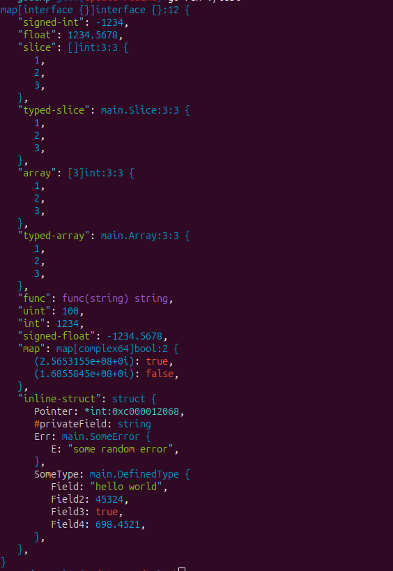

<div align="center"> 
<h1> godump </h1>
</div>

<div align="center">

[](https://badge.fury.io/gh/yassinebenaid%2Fgodump)
[](./LICENCE)

</div>

A simple GO library to dump any GO variable in a structured and colored way.

Useful during development when the standard `fmt` library doesn't help you extract arbitrary data.

## Get Started

Install the library:

```bash
go get -u github.com/yassinebenaid/godump
```

Then use the **Dump** function , you can pass any variable of any type:

```go
package main

import (
	"github.com/yassinebenaid/godump"
)

func main() {
	var anything any = "this can be anything"
	godump.Dump(anything)
}

```

# Demo

```go
package main

import (
	"github.com/yassinebenaid/godump"
)

type SomeError struct{ E string }

func (e SomeError) Error() string {
	return e.E
}

type DefinedType struct {
	Field  string
	Field2 int
	Field3 bool
	Field4 float64
}

type Slice []int
type Array [3]int

func main() {

	var a int = 55644133

	godump.Dump(map[any]any{
		"uint":         uint(100),
		"int":          1234,
		"signed-int":   -1234,
		"float":        1234.5678,
		"signed-float": -1234.5678,
		"slice":        []int{1, 2, 3},
		"typed-slice":  Slice{1, 2, 3},
		"array":        [3]int{1, 2, 3},
		"typed-array":  Array{1, 2, 3},
		"map": map[complex64]bool{
			0xf4a5c5d: true,
			0xa0bff6e: false,
		},
		"inline-struct": struct {
			Pointer      *int
			privateField string
			Err          SomeError
			SomeType     DefinedType
		}{
			Pointer:      &a,
			privateField: "private",
			Err:          SomeError{"some random error"},
			SomeType: DefinedType{
				"hello world",
				45324,
				true,
				698.4521,
			},
		},
		"func": func(string) string { return "" },
	})

}

```

Output:


